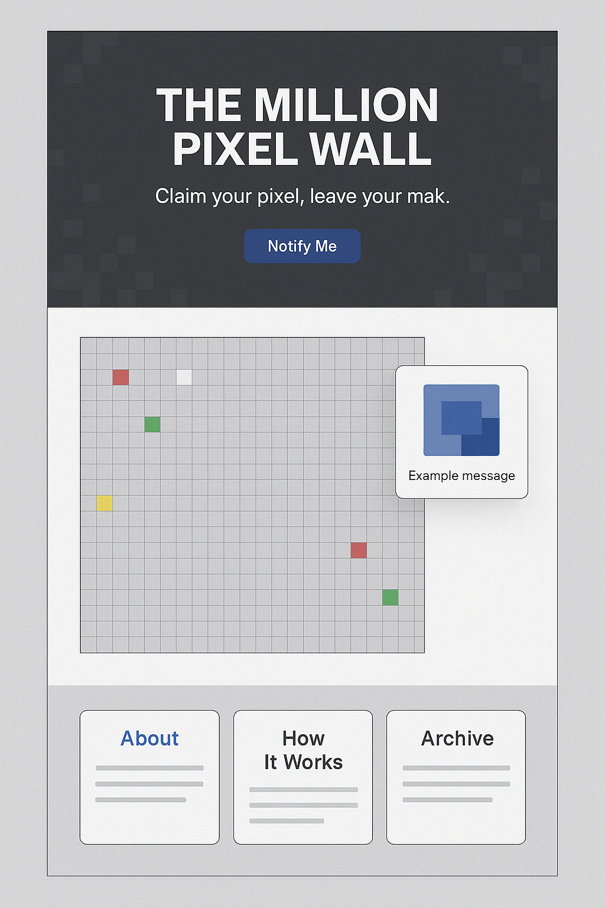

# 🧱 The Million Pixel Wall

A 20th anniversary homage to the legendary [Million Dollar Homepage](http://www.milliondollarhomepage.com/), rebuilt with modern web technologies.  
Own a piece of the pixel wall, upload your image, and leave your mark on the internet — again.

📘 [English](./README.md) | 🇰🇷 [한국어](./README.ko.md)

---

## 🌐 Demo

> Claim your pixel. Leave your mark.



---

## 🚀 Tech Stack

- **Frontend**: [Next.js 14](https://nextjs.org/), [TailwindCSS](https://tailwindcss.com/)
- **Backend**: [Supabase](https://supabase.com/) (Auth, Database, Storage)
- **Styling**: TailwindCSS, Responsive UI
- **Multilingual Support**: Built-in i18n-ready structure

---

## Installed NPM Library

1. npm install @supabase/supabase-js

---

## 📁 Project Structure

```bash
/
├── app/              # Next.js App Router structure
├── components/       # Reusable UI components
├── lib/              # Supabase client, helpers
├── styles/           # Global CSS
├── types/            # TypeScript types
└── public/           # Static assets (images, favicon, etc)
```

---

## 🧑‍💻 Getting Started

```bash
git clone https://github.com/lunalism/the-million-pixel-wall.git
cd the-million-pixel-wall

# Install dependencies
npm install

# Add your environment variables
cp .env.example .env.local

# Run locally
npm run dev
```

Make sure you have a Supabase project set up, and .env.local is properly configured with:
```env
NEXT_PUBLIC_SUPABASE_URL=...
NEXT_PUBLIC_SUPABASE_ANON_KEY=...
```

---

## 📜 License

MIT License.
Feel free to fork, contribute, and build your own wall.

---

## 🧙‍♂️ By Chrisholic & ChatGPT

2025 · Made with ❤️ in Seoul

---